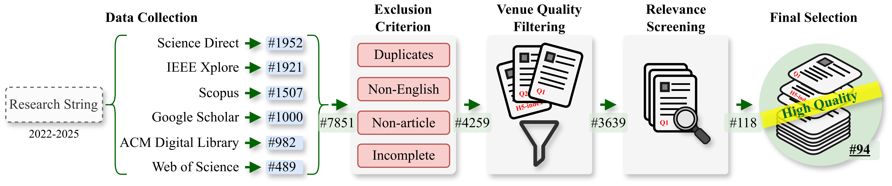
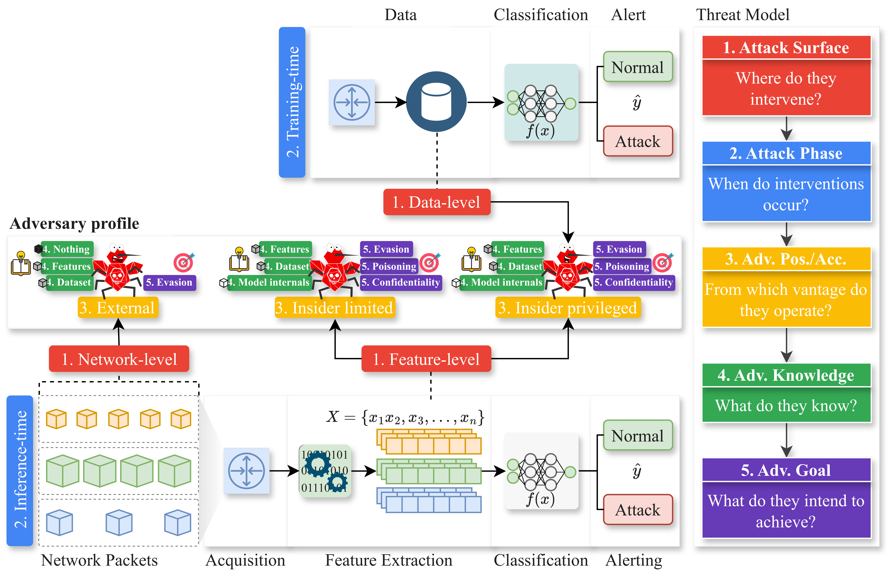

# AML-NIDS Survey Data Companion

This repository packages the data companion for *“Understanding the Adversary: A Quantitative and Taxonomic Survey of Adversarial Machine Learning in Network Intrusion Detection Systems”*.

Our corpus stems from the PRISMA-based workflow illustrated above: we queried six major digital libraries, deduplicated roughly 8,000 hits down to 4,259 unique records, filtered for venue quality, and manually screened titles, abstracts, and full texts. Progressing through identification, screening, eligibility, and inclusion yielded 94 peer-reviewed primary studies (plus 10 prior surveys) covering AML-for-NIDS research published between 2022 and early 2025.

Figure 2 encapsulates the five-axis adversary profile that anchors our survey: each study is characterized by its attack surface, attack phase, adversary position/access within the network, adversary knowledge assumptions, and adversary goal. Embedding these facets inside the ML-NIDS pipeline clarifies how adversarial leverage propagates from data acquisition through feature extraction to alerting, and provides a consistent frame for the quantitative analyses of RQ1–RQ3.

## Repository Layout
- `data/raw/taxonomy_mapping.csv` – master table encoding all 94 primary studies. Each row contains bibliographic metadata plus every taxonomy field.
- `data/derived/*.csv` – corpus-wide aggregations (datasets, models, attack surfaces, phases, positions, knowledge levels, goals, attack/defense techniques, metrics, NIDS granularity, year trends, code/data availability). These were manually curated from `taxonomy_mapping.csv` to highlight key facets in the literature.
- `figures/*.pdf` – publication-ready charts generated from the derived CSVs. Filenames match their source CSV (e.g., `data/derived/phase.csv` → `figures/phase.pdf`).
- `notebooks/SurveyPlots.ipynb` – Jupyter notebook that reads the CSVs and renders every figure from them.

## Column Dictionary (`taxonomy_mapping.csv`)
Each column describes one aspect of the AML-for-NIDS literature review:
- `Title`, `Paper`, `Year`, `Venue` – bibliographic metadata.
- `Dataset` – list of datasets leveraged (e.g., CIC-IDS-2017, UNSW-NB15, CSE-CIC-IDS-
2018).
- `Model type` – taxonomy of ML-NIDS models evaluated (e.g., Autoencoder, Tree-based, Generative).
- `NIDS granularity` – packet-based vs flow-based NIDS.
- `Surface` – attack surface targeted (network-level, feature-level, or data-level).
- `Phase` – lifecycle stage (training-time, inference-time or continous) where the adversary operates.
- `Position/Access` – attacker foothold such as external, insider-limited, or insider-privileged.
- `Knowledge` – black-box/gray-box/white-box assumptions.
- `Goal` – security objective impacted (integrity-evasion, integrity-poisoning, confidentiality and availability).
- `Attack technique` – method family (gradient, generative, heuristic, label-flipping, transfer, etc.).
- `Defense technique` – mitigation strategy (adversarial retraining, ensembles, sanitization, out-of-distribution detection, adversarial purification, etc.).
- Code/Data availability – indicates whether artifacts were released (Code+Data, Code-only, Data-only, or None).
- `Evaluation metrics` – metrics reported by the paper (e.g., Accuracy, Recall, ASR, Attack Severity).

### Snapshot of the Taxonomy Table
The unified taxonomy operationalizes the threat-model axes into analyzable layers (metadata, threat-model, methodology, and outcomes), bridging conceptual assumptions with empirical practice across all 94 studies.

| Paper (short) | Year | Datasets | Model Types | Surface | Phase |
| --- | --- | --- | --- | --- | --- |
| Adversarial attacks against deep learning-based NIDS | 2022 | CSE-CIC-IDS-2018 | CNN; Feed-forward NN; Sequence/Temporal | Feature-level | Inference-time |
| Adversarial attacks against supervised ML-based NIDS | 2022 | CIC-IDS-2017 | Generative; Tree-based; Linear/Probabilistic | Data-/Feature-level | Training & Inference |
| Black-box attack and NIDS using ML for malicious traffic | 2022 | Kitsune-Mirai; CIC-IDS-2017; MAWILab; UNSW-NB15 | Anomaly-detection; Autoencoder; Feed-forward NN; Generative; Linear/Probabilistic; Sequence/Temporal | Network-level | Inference-time |

The complete table is available at [`data/raw/taxonomy_mapping.csv`](data/raw/taxonomy_mapping.csv).

## Citation

If you leverage these artifacts, please cite the accompanying manuscript:

> A. de S. Espindola, A. O. Santin, A. Casimiro, P. M. Ferreira, and E. K. Viegas, “Understanding the Adversary: A Quantitative and Taxonomic Survey of Adversarial Machine Learning in Network Intrusion Detection Systems,” under submission (2025).