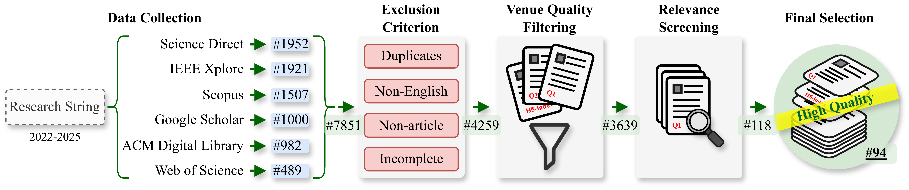
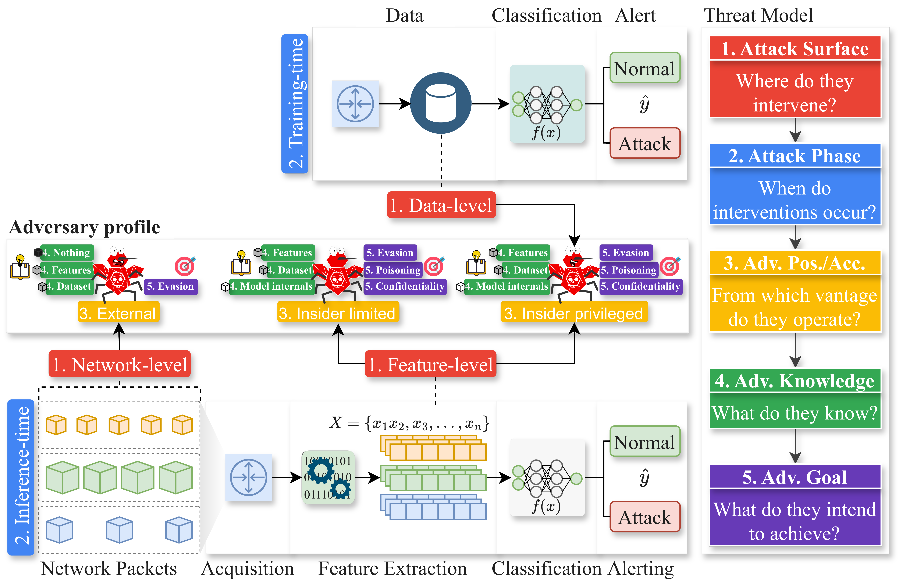

# AML-NIDS Survey Data Companion

This repository packages the data companion for *“Understanding the adversary: A survey of adversarial machine learning in network intrusion detection”*, published in *Computer Science Review*.


Our corpus stems from the PRISMA-based workflow illustrated above: we queried six major digital libraries, deduplicated roughly 8,000 hits down to 4,259 unique records, filtered for venue quality, and manually screened titles, abstracts, and full texts. Progressing through identification, screening, eligibility, and inclusion yielded 94 peer-reviewed primary studies (plus 10 prior surveys) covering AML-for-NIDS research published between 2022 and early 2025.



Figure 2 encapsulates the five-axis adversary profile that anchors our survey: each study is characterized by its attack surface, attack phase, adversary position/access within the network, adversary knowledge assumptions, and adversary goal. Embedding these facets inside the ML-NIDS pipeline clarifies how adversarial leverage propagates from data acquisition through feature extraction to alerting, and provides a consistent frame for the quantitative analyses of RQ1–RQ3.

## Repository Layout
- `data/protocol/README.md` - guide to the protocol artifacts and screening-status summaries.
- `data/raw/taxonomy_mapping.csv` – master table encoding all 94 primary studies. Each row contains bibliographic metadata plus every taxonomy field.
- `data/protocol/` - screening and selection records:
  - `coding_guide.md`
  - `exclusion_log.csv`
  - `secondary_studies.csv`
  - `scopus_sensitivity_check_summary.csv`
  - `scopus_sensitivity_exports/`
  - `journals_venue_review_log.csv`
  - `conferences_venue_review_log.csv`
  - `unranked_venue_review_log.csv`
- Key CSVs:
  - `data/raw/taxonomy_mapping.csv` – master annotated primary-study table.
  - `data/exports/acronyms_table.csv` – acronym reference.
  - `data/exports/datasets_table.csv` – datasets list.
  - `data/exports/model_families_table.csv` – unified model families.
  - `data/exports/metrics_table_full.csv` – metrics list.
  - Per facet summaries in `data/derived/` (models, datasets, metrics, surfaces, phases, positions, knowledge, goals, attack/defense techniques, granularity, year, code/data).
- `figures/*.pdf` – Plots generated from the derived CSVs.
- `notebooks/SurveyPlots.ipynb` – Jupyter notebook that reads the CSVs and renders every figure from them.

## Column Dictionary (`taxonomy_mapping.csv`)
Each column describes one aspect of the AML-for-NIDS literature review:
- `Title`, `Paper`, `Year`, `Venue` – bibliographic metadata.
- `Dataset` – list of datasets leveraged (e.g., CIC-IDS-2017, UNSW-NB15, CSE-CIC-IDS-
2018).
- `Model type` – taxonomy of ML-NIDS models evaluated (e.g., Autoencoder, Tree-based, Generative).
- `NIDS granularity` – packet-based vs flow-based NIDS.
- `Surface` – attack surface targeted (network-level, feature-level, or data-level).
- `Phase` – lifecycle stage (training-time, inference-time, or continuous) where the adversary operates.
- `Position/Access` – attacker foothold such as external, insider-limited, or insider-privileged.
- `Knowledge` – black-box/gray-box/white-box assumptions.
- `Goal` – security objective impacted (integrity-evasion, integrity-poisoning, confidentiality, and combinations of these goals).
- `Attack technique` – method family (gradient, generative, heuristic, label-flipping, transfer, etc.).
- `Defense technique` – mitigation strategy (adversarial retraining, ensembles, sanitization, out-of-distribution detection, adversarial purification, etc.).
- Code/Data availability – indicates whether artifacts were released (Code+Data, Code-only, Data-only, or None).
- `Evaluation metrics` – metrics reported by the paper (e.g., Accuracy, Recall, ASR, Attack Severity).

### Snapshot of the Taxonomy Table
The unified taxonomy organizes the literature around a three-level core hierarchy: threat assumptions, method implementation, and outcome evaluation. These core layers are complemented by supporting context facets, such as models, datasets, and reproducibility markers, so conceptual assumptions can be connected to empirical practice across all 94 studies.

| Paper (short) | Year | Datasets | Model Types | Surface | Phase |
| --- | --- | --- | --- | --- | --- |
| Adversarial attacks against deep learning-based NIDS | 2022 | CSE-CIC-IDS-2018 | CNN; Feed-forward NN; Sequence/Temporal | Feature-level | Inference-time |
| Adversarial attacks against supervised ML-based NIDS | 2022 | CIC-IDS-2017 | Generative; Tree-based; Linear/Probabilistic | Data-/Feature-level | Training & Inference |
| Black-box attack and NIDS using ML for malicious traffic | 2022 | Kitsune-Mirai; CIC-IDS-2017; MAWILab; UNSW-NB15 | Anomaly-detection; Autoencoder; Feed-forward NN; Generative; Linear/Probabilistic; Sequence/Temporal | Network-level | Inference-time |

The complete table is available at [`data/raw/taxonomy_mapping.csv`](data/raw/taxonomy_mapping.csv).
Field-level coding guidance is documented in [`data/protocol/coding_guide.md`](data/protocol/coding_guide.md).

## Citation


If you leverage these artifacts, please cite the data companion:

> A. da S. Espindola, A. O. Santin, A. Casimiro, P. M. Ferreira, and E. K. Viegas, “AML-NIDS Survey Data Companion”. Data DOI: 10.21227/mdwb-bw29

The accompanying article can be cited separately:

> A. da S. Espindola, A. O. Santin, A. Casimiro, P. M. Ferreira, and E. K. Viegas, “Understanding the adversary: A survey of adversarial machine learning in network intrusion detection”, *Computer Science Review*, vol. 62, article 100995, 2026. DOI: 10.1016/j.cosrev.2026.100995

```bibtex
@article{ESPINDOLA2026100995,
  title = {Understanding the adversary: A survey of adversarial machine learning in network intrusion detection},
  journal = {Computer Science Review},
  volume = {62},
  pages = {100995},
  year = {2026},
  issn = {1574-0137},
  doi = {https://doi.org/10.1016/j.cosrev.2026.100995},
  url = {https://www.sciencedirect.com/science/article/pii/S1574013726001036},
  author = {Allan da S. Espindola and Altair O. Santin and António Casimiro and Pedro M. Ferreira and Eduardo K. Viegas},
  keywords = {Adversarial machine learning, Intrusion detection, Network security, Taxonomy, Survey},
  abstract = {Adversarial machine learning (AML) is a growing threat to network intrusion detection systems (NIDS). However, the literature remains fragmented across models, datasets, and evaluation practices. This survey provides a post-2021 synthesis of AML for machine learning-based NIDS and, to the best of our knowledge, is the first survey in this period to combine a coded corpus of 94 quality-screened primary studies (2022-2025) with a unified hierarchical taxonomy and quantitative mapping across threat models, methods, datasets, metrics, and reproducibility characteristics. Our analysis reveals persistent biases toward feature-space manipulation, dataset-specific dependencies, overly optimistic assumptions about adversary knowledge, and evasion-centric evaluation methodologies. It also identifies emerging trends, including ensemble-based defenses, IoT/ICS data realism, and enhanced reproducibility. Combining conceptual and quantitative perspectives, we establish a reproducible research mapping framework that identifies six open challenges defining the next stage of adversarially robust intrusion detection. Thus, we provide a roadmap toward trustworthy, empirically grounded, and operationally viable AML-NIDS in adversarial settings.}
}
```
